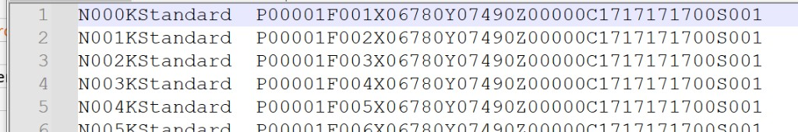
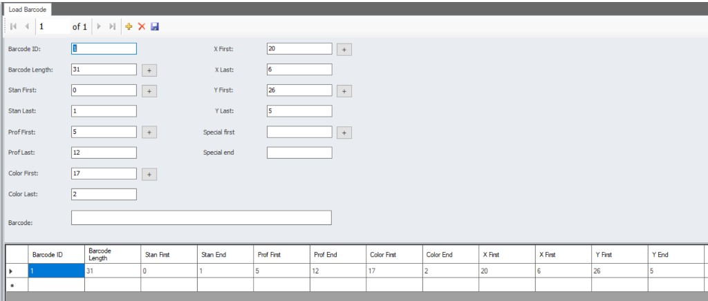

# MWM HMI Arayüzü — KD658 Barkod Okuyucu ve İş Dosyası

KD658 barkod okuyucu, MWM HMI üzerinde iki farklı çalışma modunda kullanılır: **iş dosyası ile** ve **iş dosyasız**.

## İş dosyası ile çalışırken

İş dosyası (batch dosyası) yüklüyken barkod tarandığında, barkod içeriğinde **N karakterinin ardından gelen 3 hane** yeterlidir. HMI, bu numarayı iş dosyasındaki satırla eşleştirir ve satırdaki tüm üretim verisini kullanır.



Örnek iş dosyası satırları (`batch_test_1.txt`):

```
N000KStandard  P00001F001X06780Y07490Z00000C1717171700S001
N001KStandard  P00001F002X06780Y07490Z00000C1717171700S001
N002KStandard  P00001F003X06780Y07490Z00000C1717171700S001
```

Bu örnekte `N000`, `N001`, `N002` gibi liste numaraları barkod tarandığında eşleşme anahtarı olarak kullanılır. Operatör yalnızca `000`, `001` veya `002` gibi N sonrası 3 haneyi tarayarak ilgili satırdaki üretim verisine ulaşır.

### İş dosyası satır formatı (KD6xx)

Her satır, sabit başlık karakterleriyle ayrılmış alanlardan oluşur. Alan tanımları `KD6xx_BathcFile_Desc.xlsx` dosyasına göredir:

| Karakter | Başlık | Boyut | Tip | Açıklama |
|----------|--------|-------|-----|----------|
| N | Liste numarası | N + 3 karakter | Sayısal | Barkod eşleşmesinde kullanılan sıra numarası |
| K | Profil kodu | K + 10 karakter | Metin | Profil tanımı (ör. `Standard`, `Profiles01`) |
| P | BIN / Trolley numarası | P + 5 karakter | Sayısal | Palet veya trolley numarası |
| F | Pencere numarası | F + 3 karakter | Sayısal | Pencere sıra numarası |
| X | Çerçeve X değeri | X + 5 karakter | Sayısal | Beşinci karakter ondalık basamağıdır. Örn. `15005` = 1500,5 |
| Y | Çerçeve Y değeri | Y + 5 karakter | Sayısal | Beşinci karakter ondalık basamağıdır. Örn. `15005` = 1500,5 |
| Z | Kullanılmıyor | Z + 5 karakter | Metin | Rezerve alan |
| C | Operatör bilgisi | C + 10 karakter | Metin | Operatör için ek bilgi |
| S | Adet | S + 3 karakter | Sayısal | Üretim adedi |

**Örnek satır (xlsx):**

```
N000KProfiles01P00001F001X06780Y07490Z00000C1717171700S001
```

**İş dosyası örneği ----->>>** [batch_test_1.txt](./batch_test_1.txt)

## İş dosyasız modda

İş dosyası yüklü değilken barkod verisi doğrudan taranan string üzerinden ayrıştırılır. Gerekli alanlar MWM HMI **Load Barcode** ekranından tanımlanır.



### Genel ayarlar

| Alan | Değer | Açıklama |
|------|-------|----------|
| Barcode ID | 1 | Barkod tanım kimliği. Birden fazla barkod formatı tanımlanacaksa her biri farklı bir ID ile kaydedilir. |
| Barcode Length | 31 | Taranan barkodun toplam karakter uzunluğu. Ayrıştırma bu uzunluğa göre yapılır. |
| Barcode | — | Test amaçlı barkod giriş alanı. Tanımlanan index ve uzunlukların doğruluğunu kontrol etmek için örnek barkod buraya yazılabilir. |

### Alan ayrıştırma ayarları

Index değerleri **0 tabanlıdır** (barkodun ilk karakteri index 0). **First** alanı ilgili verinin barkod içindeki başlangıç indexini, **Last / End** alanı ise First değerinden itibaren okunacak karakter (digit) sayısını belirtir.

| Alan | Değer | Açıklama |
|------|-------|----------|
| Stan First | 0 | Standart karakterin barkod başlangıç indexi. |
| Stan Last | 1 | Stan First değerinden itibaren okunacak karakter sayısı. |
| Prof First | 5 | Profil kodunun barkod başlangıç indexi. |
| Prof Last | 12 | Prof First değerinden itibaren okunacak karakter sayısı. |
| Color First | 17 | Profil renk kodunun barkod başlangıç indexi. |
| Color Last | 2 | Color First değerinden itibaren okunacak karakter sayısı. |
| X First | 20 | Çerçeve X ekseni uzunluğunun barkod başlangıç indexi. |
| X Last | 6 | X First değerinden itibaren okunacak karakter sayısı. |
| Y First | 26 | Çerçeve Y ekseni uzunluğunun barkod başlangıç indexi. |
| Y Last | 5 | Y First değerinden itibaren okunacak karakter sayısı. |
| Special first | — | İsteğe bağlı özel alan için barkod başlangıç indexi. Standart alanlara ek veri okunması gerektiğinde tanımlanır. |
| Special end | — | Special first değerinden itibaren okunacak karakter sayısı. Special first ile birlikte kullanılır. |

### Özet tablo

| Alan | First | Last / End |
|------|-------|------------|
| Stan | 0 | 1 |
| Prof | 5 | 12 |
| Color | 17 | 2 |
| X | 20 | 6 |
| Y | 26 | 5 |

İş dosyasız modda taranan 31 karakterlik barkod, yukarıdaki index ve uzunluk değerlerine göre Stan, Prof, Color, X ve Y alanlarına ayrıştırılır. Special first / Special end tanımlanırsa ek bir özel alan da aynı mantıkla okunur.
